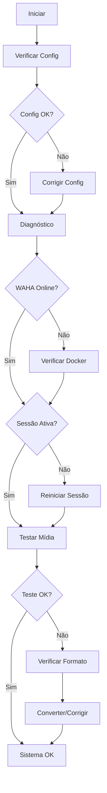

# 🔧 Sistema de Solução de Problemas de Mídia - WAHA

Sistema completo para diagnóstico, teste e resolução automática de problemas de envio de mídia no WAHA (WhatsApp HTTP API).

## 📋 Visão Geral

Este sistema foi desenvolvido para resolver os problemas mais comuns relacionados ao envio de mídia (imagens, vídeos, áudios, documentos) através do WAHA. Inclui ferramentas de diagnóstico automático, teste de formatos, monitoramento em tempo real e correção automática de problemas.

## 🗂️ Arquivos do Sistema

### 📄 Arquivos Principais

| Arquivo | Descrição | Uso |
|---------|-----------|-----|
| `solucionar_midia_waha.py` | **Script principal** - Interface unificada | Menu interativo e comandos |
| `diagnostico_midia_waha.py` | Diagnóstico automático completo | Detecta problemas de configuração |
| `teste_formatos_midia.py` | Teste de formatos e envio de mídia | Valida arquivos e testa envios |
| `monitor_waha_realtime.py` | Monitoramento em tempo real | Monitora status e detecta falhas |
| `GUIA_SOLUCAO_MIDIA_WAHA.md` | Guia detalhado de soluções | Documentação completa |

### 📋 Arquivos de Configuração

- `config.json` - Configurações do WAHA (criado automaticamente)
- `env.example` - Exemplo de variáveis de ambiente

## 🚀 Início Rápido

### 1. Verificação Inicial

```bash
# Verificar se todos os scripts estão presentes
python solucionar_midia_waha.py --help
```

### 2. Menu Interativo (Recomendado)

```bash
# Iniciar interface interativa
python solucionar_midia_waha.py
```

### 3. Comandos Diretos

```bash
# Diagnóstico completo
python solucionar_midia_waha.py --diagnostico

# Verificação rápida
python solucionar_midia_waha.py --status

# Resolver automaticamente
python solucionar_midia_waha.py --resolver
```

## 🔍 Funcionalidades Detalhadas

### 1. 🩺 Diagnóstico Automático

**Arquivo:** `diagnostico_midia_waha.py`

**O que verifica:**
- ✅ Configuração do sistema
- ✅ Conectividade com WAHA
- ✅ Validade do token de API
- ✅ Status da sessão WhatsApp
- ✅ Funcionamento dos endpoints de mídia

**Uso:**
```bash
# Diagnóstico completo
python diagnostico_midia_waha.py

# Com teste de envio
python diagnostico_midia_waha.py +5511999999999 arquivo_teste.jpg
```

**Saída:**
- Relatório detalhado em JSON
- Log de problemas encontrados
- Recomendações de correção
- Tentativas de correção automática

### 2. 🧪 Teste de Formatos

**Arquivo:** `teste_formatos_midia.py`

**Formatos suportados:**
- 🖼️ **Imagens:** JPG, PNG, WebP (até 16MB)
- 🎥 **Vídeos:** MP4, 3GP (até 16MB, codec H.264)
- 🎵 **Áudios:** AAC, MP3, AMR, OGG (até 16MB)
- 📄 **Documentos:** PDF, DOC, XLS, TXT, ZIP (até 100MB)

**Uso:**
```bash
# Listar formatos suportados
python teste_formatos_midia.py --formatos

# Testar arquivo específico
python teste_formatos_midia.py imagem.jpg +5511999999999

# Testar diretório completo
python teste_formatos_midia.py --dir uploads +5511999999999

# Criar arquivos de teste
python teste_formatos_midia.py --criar-teste
```

### 3. 📊 Monitoramento em Tempo Real

**Arquivo:** `monitor_waha_realtime.py`

**Recursos:**
- 🔄 Verificação contínua do status
- 📈 Métricas de disponibilidade
- 🚨 Detecção automática de problemas
- 🔧 Correção automática de falhas
- 📊 Relatórios de uptime

**Uso:**
```bash
# Monitoramento padrão (30s)
python monitor_waha_realtime.py

# Intervalo personalizado
python monitor_waha_realtime.py --intervalo 60

# Verificação única
python monitor_waha_realtime.py --status
```

### 4. 🎯 Interface Unificada

**Arquivo:** `solucionar_midia_waha.py`

**Menu Interativo:**
1. 🔍 Diagnóstico completo
2. ⚡ Verificação rápida de status
3. 🧪 Testar formatos de mídia
4. 📤 Testar envio de arquivo específico
5. 🔍 Iniciar monitoramento em tempo real
6. 🔧 Resolver problemas automaticamente
7. ⚙️ Verificar/corrigir configuração
8. 📖 Mostrar sugestões
9. ❌ Sair

## ⚙️ Configuração

### Arquivo config.json

```json
{
  "base_url": "http://localhost:3000",
  "token": "seu-token-waha",
  "instance_id": "default",
  "provider": "waha",
  "timeout": 60,
  "max_retries": 3
}
```

### Criação Automática

O sistema cria automaticamente a configuração se não existir:

```bash
python solucionar_midia_waha.py --config
```

## 🚨 Problemas Comuns e Soluções

### ❌ Erro HTTP 401 (Não Autorizado)

**Causa:** Token de API inválido

**Solução Automática:**
- ✅ Verificação do token
- ✅ Solicitação de novo token
- ✅ Atualização da configuração

### ❌ Erro HTTP 422 (Dados Inválidos)

**Causa:** Formato de arquivo não suportado

**Solução Automática:**
- ✅ Validação de formato
- ✅ Verificação de tamanho
- ✅ Sugestão de conversão

### ❌ Erro HTTP 500 (Erro Interno)

**Causa:** Problema no servidor WAHA

**Solução Automática:**
- ✅ Reinício da sessão
- ✅ Verificação de logs
- ✅ Recomendação de atualização

### 📱 Sessão WhatsApp Desconectada

**Solução Automática:**
- ✅ Detecção de desconexão
- ✅ Reinício automático da sessão
- ✅ Geração de novo QR Code

## 📊 Relatórios e Logs

### Arquivos Gerados

| Arquivo | Conteúdo | Quando |
|---------|----------|--------|
| `diagnostico_waha_YYYYMMDD_HHMMSS.json` | Resultado do diagnóstico | Após diagnóstico |
| `relatorio_formatos_YYYYMMDD_HHMMSS.json` | Teste de formatos | Após teste de diretório |
| `relatorio_monitor_YYYYMMDD_HHMMSS.json` | Métricas de monitoramento | Ao parar monitor |
| `monitor_waha.log` | Log contínuo do monitor | Durante monitoramento |
| `teste_arquivo_YYYYMMDD_HHMMSS.json` | Resultado de teste individual | Após teste de arquivo |

### Estrutura dos Relatórios

```json
{
  "timestamp": "2024-01-15T10:30:00",
  "config_valida": true,
  "waha_online": true,
  "sessao_ativa": true,
  "problemas": [],
  "recomendacoes": [],
  "metricas": {
    "tempo_resposta": 0.234,
    "disponibilidade": 99.5
  }
}
```

## 🔧 Correções Automáticas

### Implementadas

- ✅ **Reinício de sessão** quando falha
- ✅ **Validação de token** e solicitação de novo
- ✅ **Verificação de formato** antes do envio
- ✅ **Retry automático** em caso de falha temporária
- ✅ **Detecção de problemas** de conectividade

### Em Desenvolvimento

- 🔄 Conversão automática de formatos
- 🔄 Otimização automática de tamanho
- 🔄 Backup automático de configuração
- 🔄 Integração com webhooks

## 📈 Métricas e Monitoramento

### Métricas Coletadas

- 📊 **Uptime** do WAHA
- 📊 **Taxa de sucesso** de envios
- 📊 **Tempo de resposta** médio
- 📊 **Número de reconexões** automáticas
- 📊 **Problemas detectados** por categoria

### Dashboard em Tempo Real

```
[2024-01-15 10:30:00] ✅ Status: WAHA=ON | Sessão=WORKING | Uptime=3600s | Taxa sucesso=98.5%
```

## 🛠️ Requisitos do Sistema

### Python
- Python 3.7+
- Bibliotecas: `requests`, `json`, `threading`

### WAHA
- WAHA Core ou WAHA Plus
- Token de API válido
- Sessão WhatsApp ativa

### Docker (Recomendado)
```yaml
version: '3.8'
services:
  waha:
    image: devlikeapro/waha-plus:chrome
    ports:
      - "3000:3000"
    environment:
      - WAHA_API_KEY=seu-token-aqui
```

## 🔄 Fluxo de Resolução Automática



## 📞 Suporte e Troubleshooting

### Logs Importantes

```bash
# Logs do WAHA
docker logs container_waha

# Logs do sistema
tail -f monitor_waha.log

# Status do Docker
docker ps
docker-compose ps
```

### Comandos de Emergência

```bash
# Reiniciar WAHA
docker-compose restart

# Verificar portas
netstat -tulpn | grep 3000

# Limpar cache
docker system prune
```

### Verificação Manual

```bash
# Testar conectividade
curl http://localhost:3000/api/health

# Verificar sessões
curl -H "X-API-KEY: seu-token" http://localhost:3000/api/sessions
```

## 🎯 Próximos Passos

1. **Execute o diagnóstico inicial:**
   ```bash
   python solucionar_midia_waha.py --diagnostico
   ```

2. **Configure o monitoramento:**
   ```bash
   python solucionar_midia_waha.py --monitor
   ```

3. **Teste seus arquivos:**
   ```bash
   python solucionar_midia_waha.py --teste seu_arquivo.jpg
   ```

4. **Consulte o guia detalhado:**
   - Leia `GUIA_SOLUCAO_MIDIA_WAHA.md`
   - Verifique os relatórios gerados
   - Monitore os logs continuamente

## 📚 Documentação Adicional

- 📖 [Guia Completo de Soluções](GUIA_SOLUCAO_MIDIA_WAHA.md)
- 📖 [Limitações do WAHA Core](LIMITACOES_WAHA_CORE.md)
- 📖 [Guia da Evolution API](README_EVOLUTION_API.md)
- 📖 [Documentação Oficial do WAHA](https://waha.devlike.pro/)

---

**🎉 Sistema desenvolvido para resolver definitivamente os problemas de envio de mídia no WAHA!**

*Última atualização: Janeiro 2024*